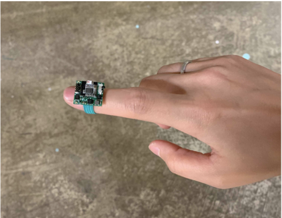
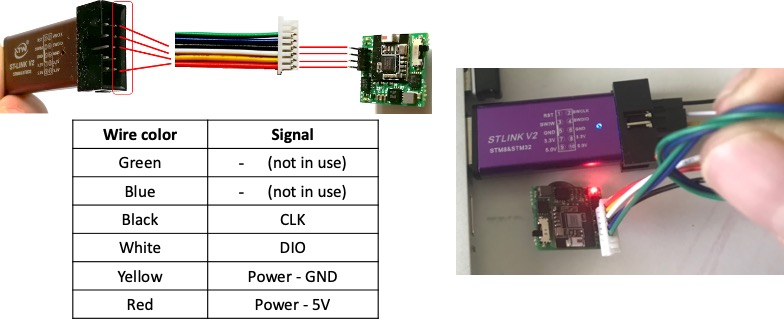

# Motion Sensor in Unity
Thank you for your purchase of our wireless Motion sensor!

The module includes a 6-axis accelerometer & gyroscope to capture motion in the smallest package including BLE and rechargeable battery system.
If you haven’t already checked out our motion sensor in the works, here is our demo video!

https://youtu.be/URmmf9Vr7ig

## Precautions for Safe Operation
1. Motion sensor and Nimbus 9 battery are small and present a choking hazard. Keep them stored safely away from children and animals.
2. Store the Motion sensor at room temperature. Avoid contact with any liquids.
3. Keep the battery in use in Motion sensor. Keep the extra batteries in the plastic case provided for the battery individually. Do not store in the same container. Do not place the battery on the metal surface. Handle with provided plastic tweezers only. Do not handle with metal tweezers. This will create external short and potential sparks, heating, of the battery.
4. Use correct battery polarity. The narrow face of the battery is the negative (-) terminal. The wide and flat face is the positive (+) terminal. Make sure the battery is loaded with the negative (-) terminal facing the circuit board and the positive (+) terminal touching the outer part of the battery holder.

  

5. Always switch OFF the Motion sensor when not in use. Leaving it ON with a depleted battery for long periods may damage the battery and require a battery replacement. 

#### Example: IMU dev kit on finger tip for motion capture, interactive concert, game controller, etc.

## IMU development kit components
1. IMU module
2. Nimbus9 battery
3. USB charging stick
4. USB bluetooth receiver

## Charging a battery(Nimbus9)
*Please refer to Section 1: Precautions for Safe Operation before charging.*

Nimbus 9 battery ships 30% charged (voltage ~ 3.7 V). You need to charge the battery before using. The IMU comes with cables connected to a USB charger.

To charge the battery simply plug the USB charger stick to a USB port. Make sure the RED cable is connected to the innermost pin as shown in the picture below. There will be a red LED light on while charging. Once the battery is fully charged, the red LED light will turn off. Normally, it may take about 2 hours to fully charge the battery. The runtime of a fully charged battery is 2-3 hours.

You can operate the module while connected to the USB charger as long as the battery is installed.

# Getting Started

## Prerequisites
1. [CP210x USB to UART Bridge VCP Drivers](https://www.silabs.com/developers/usb-to-uart-bridge-vcp-drivers): Download "CP210x Universal Windows Driver" and install "CP210xVCPInstaller_x64.exe"
2. [Unity](https://store.unity.com/#plans-individual): Personal user has a free version of Unity. Download and install the Unity.
3. [Visual Studio](https://visualstudio.microsoft.com/downloads/)

#### Below demonstration was built and tested in Windows 10 64-bit

## Bulid an Unity project
1. Create a new Unity project. 
    Choose "3D" teamplate and make a project name as "IMU_Control_volt_beta"
    
2. Create a Cube object.
    GameObject -> 3D Object -> Cube
    
3. Set scale of the Cube.
    Click the "Cube" in the Hierachy window
    Inspection window: Set Scale (1, 1, 0.1)

4. Create a 3D Text object under Main Camera
    Right click the "Main Camera" in the Hierachy window: 3D Object -> 3D Text
    
5. Set scale and change name of the 3D Text
    Click the "New Text" in the Hierachy window
    Inspection window: Rename to "Volt"
                       Set Position (-2, 0, 4)
